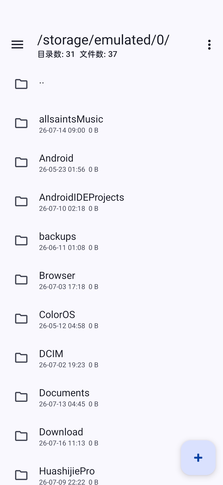
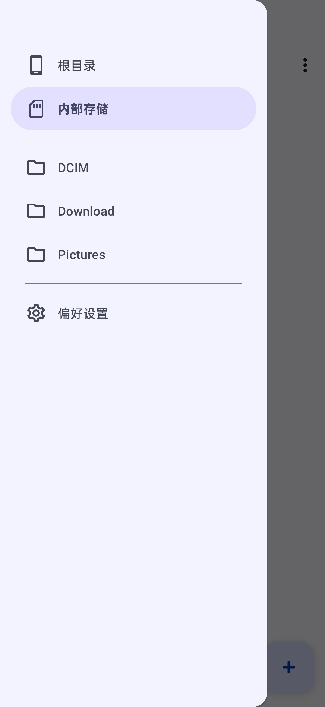
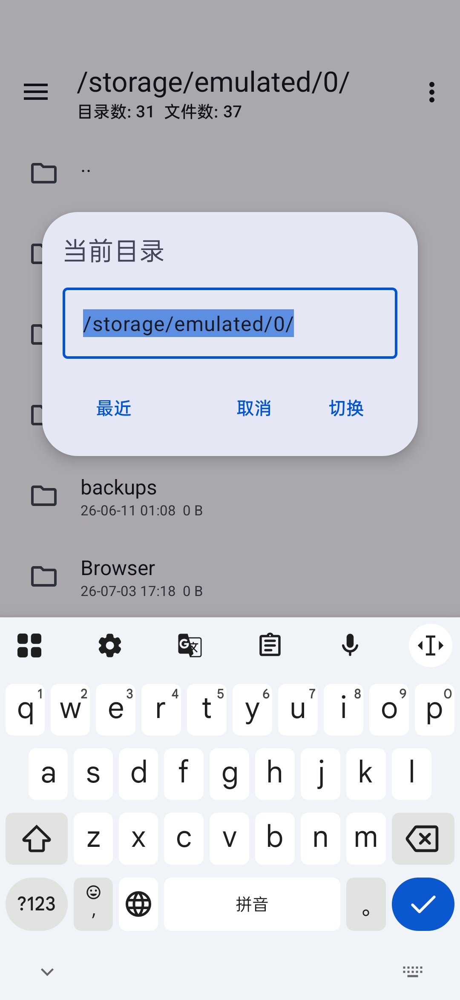
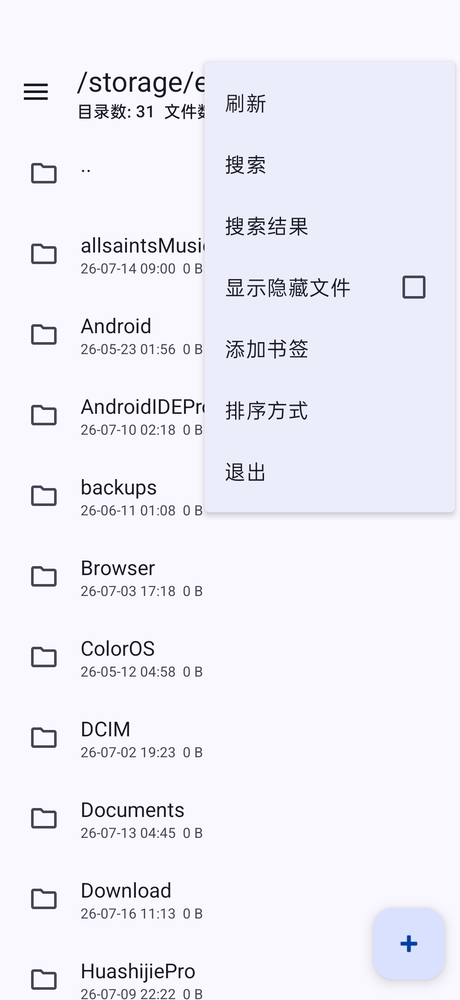
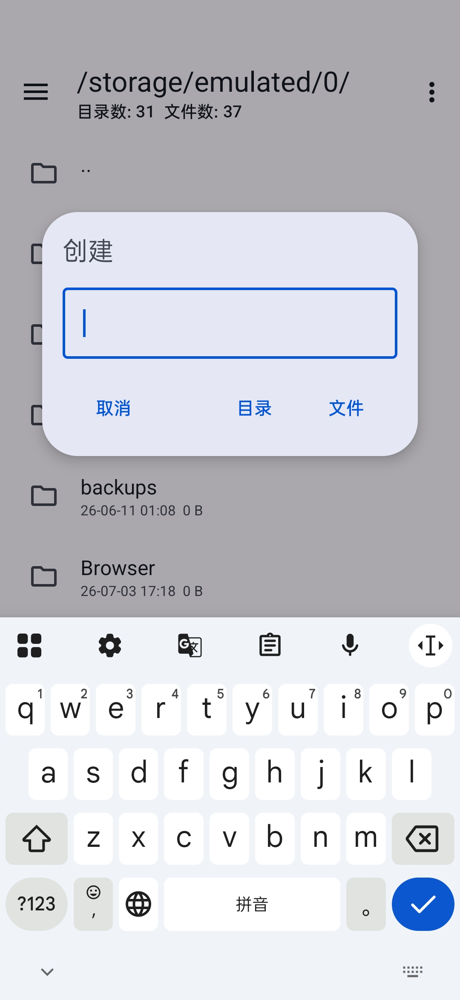
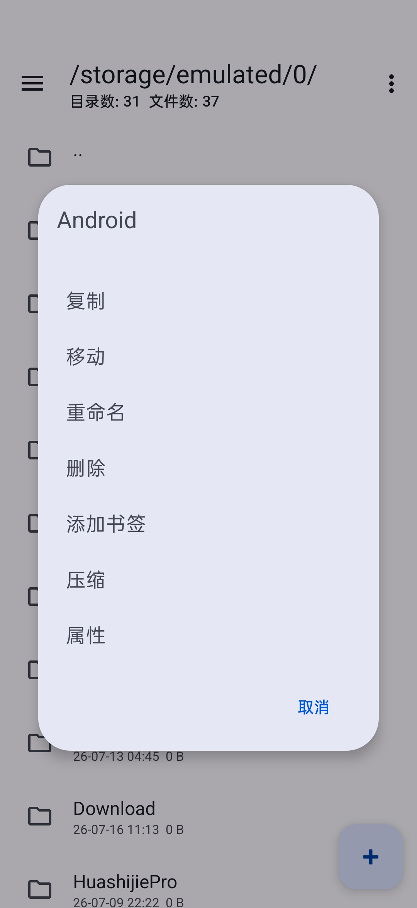
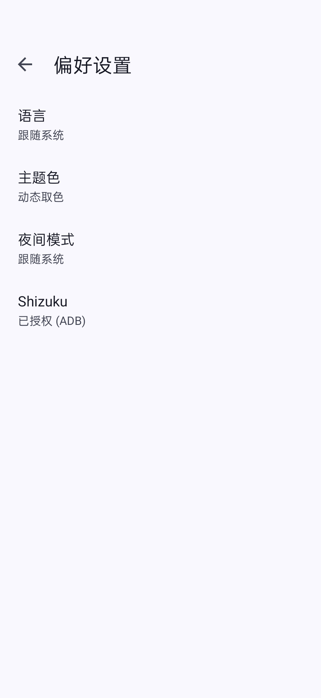
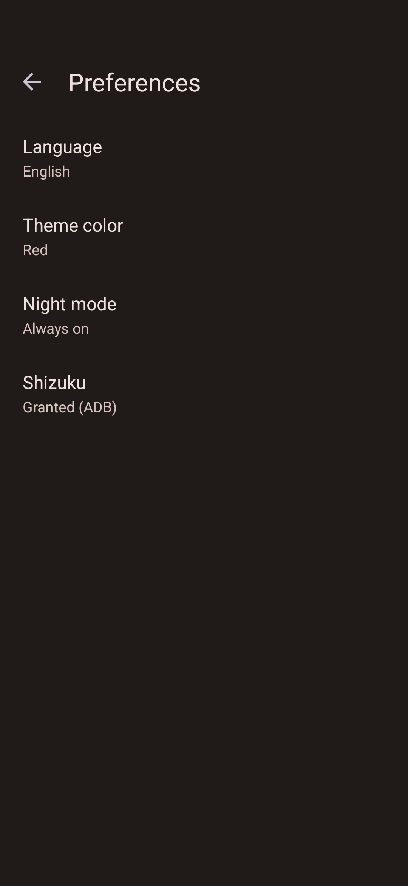
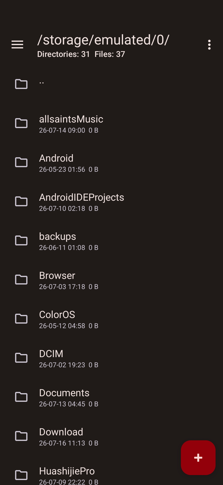

# ZhuFiler

[中文](README.md) English

An open-source Android file manager written in Kotlin  
Open-source free, Beautiful powerful

## Preview

  
  
  

## Features

- Open-source: MIT licensed, fully transparent and auditable code, open to community contributions
- Free: No ads, no in-app purchases — all features are permanently free and unrestricted
- Beautiful: Material You dynamic theming with dark mode and multiple color schemes
- Powerful: Built-in archive extraction, file editing, media playback, APK management, and Shizuku support

## Dev-spec

This project follows the [ZhuFiler Five-Chapter Nineteen-Article Development Specification](./ZhuFiler_Spec.md). All code submissions must comply with it.
